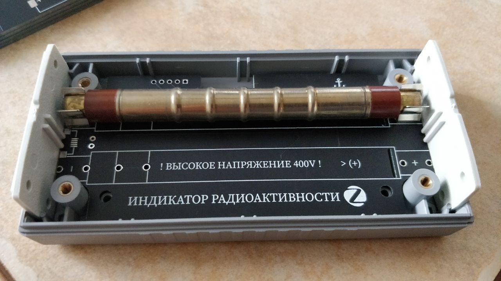

# Geiger counter

# How to join
## Reset to FN rebooting device 5 times with interval less than 10 seconds, led will start flashing during reset

# How to change parameters
Sensitivity:
`mosquitto_pub -t "zigbee2mqtt/FN/BUTTON_NUM/set/sensitivity" -m '100'`
This attribute will be used on reporting, pulsesCount * sensitivity.
You can use this attribute to setup reporting in your prefered units
radiationDosePerHour = pulsesCount * sensitivity

Led feedback (ON/OFF) (default=ON)
`mosquitto_pub -t "zigbee2mqtt/FN/1/set/led_feedback" -m 'ON'`

Buzzer feedback (ON/OFF) (default=OFF)
`mosquitto_pub -t "zigbee2mqtt/FN/1/set/buzzer_feedback" -m 'ON'`
# How to add device into zigbe2mqtt
tbd

