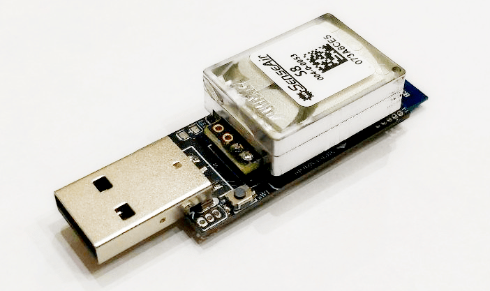

# Air quality sensor

# How to join
## Reset to FN rebooting device 5 times with interval less than 10 seconds, led will start flashing during reset
## Reset to FN by pressing and holding button(1) 5 seconds

# How to add device into zigbe2mqtt
Use [external converters](https://www.zigbee2mqtt.io/information/configuration.html#external-converters-configuration) feature

Converter file located [here](./converters/DIYRuZ_AirSense.js)
